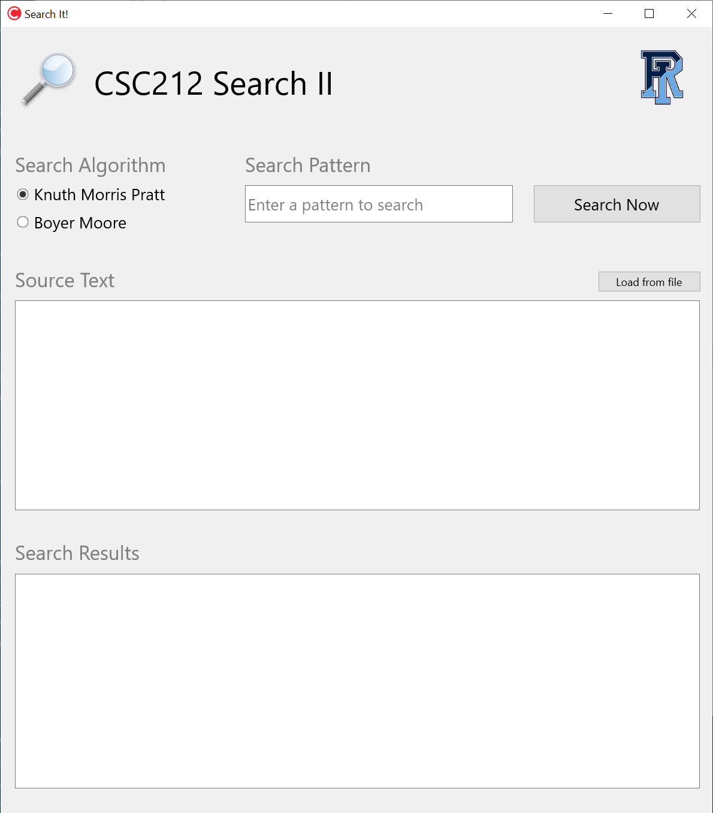
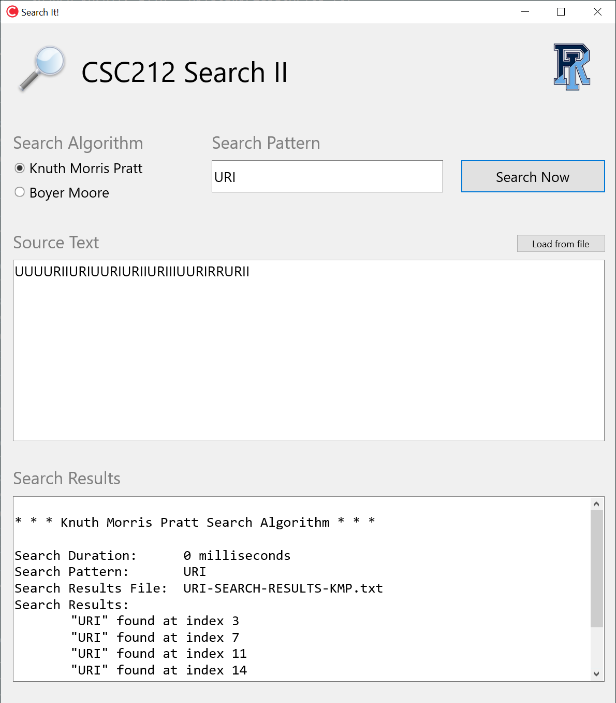
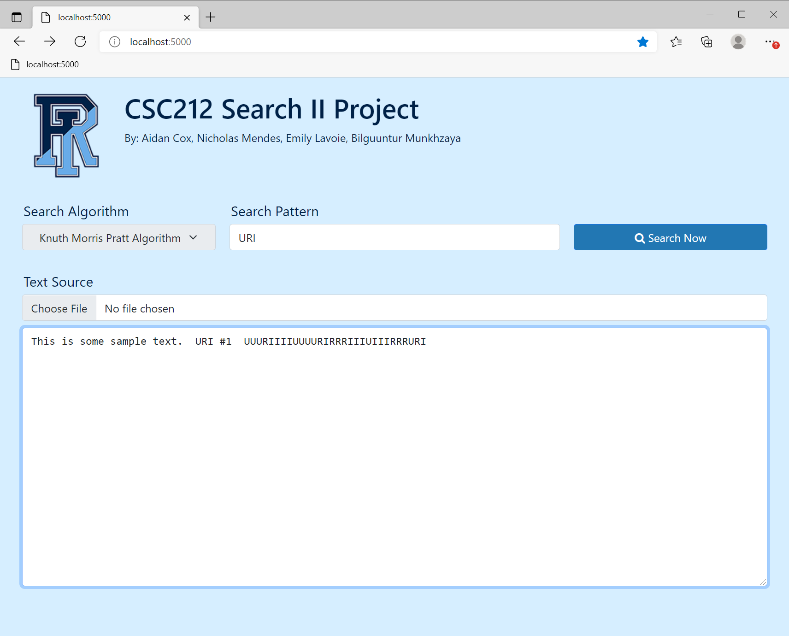
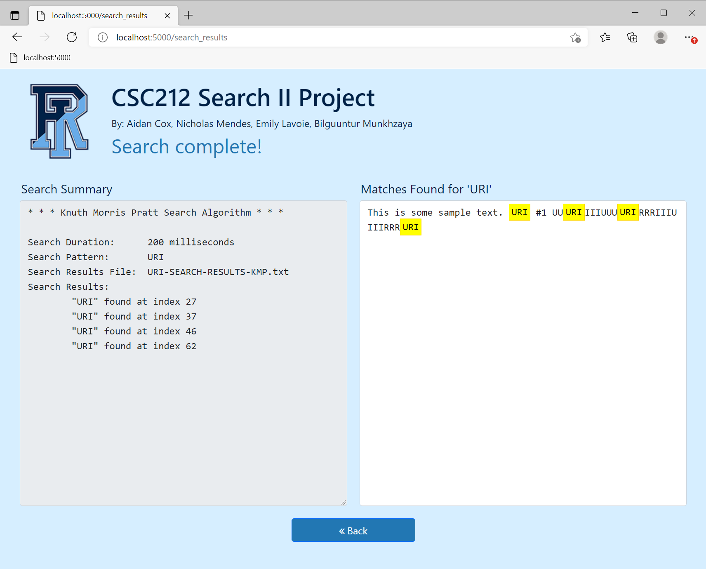

# CSC212 Fall 2021 Project - String Search II


Our project focused on implementing **2 search alogrithms** as well as implementating **3 applications** which allow the user to interact with those search implementations. We also have supporting visualizations, [slides](https://github.com/aidancox24/String_Seach_II/tree/main/Presentation) and a [project report](https://github.com/aidancox24/String_Seach_II/tree/main/project-report).

This readme provides more information about our code structure, coding implementation, application demos, how to build and links to all available resources related to our project.

# Table of Contents
* [Project Team](#project-team)
* [Individual Contributions](#individual-contributions)
* [Quick Download Links](#quick-download-links)
* [Application Demos](#application-demos)
* [Building the Source Code](#Building-the-Source-Code)

# Project Team (Team #18)


# Individual Contributions

**Aidan Cox**
- Main CLI C++ Class implementation
- Windows GUI App C++ implementation
- Web App Python/HTML/JS implementation
- Github maintenance/Readme.md author

**Nicholas Mendes**
 - Knuth-Morris-Pratt search C++ implementation
 - Boyer-Moore search C++ implementation
 - Benchmarking

**Emily Lavoie** 
- Project Presentation slides
- Visualizations

**Bilguuntur Munkhzaya** 
- Knuth-Morris-Pratt Research
- Sources
- Project Report

# Quick Download Links

Here are some quick links to easily download project-related resources.

[Project Report](https://github.com/aidancox24/String_Seach_II/tree/main/project-report)

[Project Presentation Slides](https://github.com/aidancox24/String_Seach_II/tree/main/Presentation)

[Source Code Files](https://github.com/aidancox24/String_Seach_II/tree/main/source) 

[Search CLI executable](https://github.com/aidancox24/String_Seach_II/blob/main/downloads/SearchIt.exe) 

[Search Windows GUI App](https://github.com/aidancox24/String_Seach_II/blob/main/downloads/SearchIt-app.exe)

# Application Demos

In addition to the implementation of our Search class and algorithm implementations, we decided to create 3 separate applications to show how we could use our core search code, and use it in 3 different application technologies:

- [Command Line Interface (CLI)](#command-line-interface-demo)
- [Windows-based GUI](#windows-based-gui-demo)
- [Web-based GUI](#web-based-gui-demo)

The following sections provides details on how to demo our applications.

## Command Line Interface (Demo)
This is our main application which has all of our search CLI logic and search algorithm implementations. To run our CLI demo, follow these instructions:

--> Download our [SearchIt.exe](https://github.com/aidancox24/String_Seach_II/blob/main/downloads) to a directory

--> Open a terminal window and continue below with different command examples to demo

--> To see the usage info for supported arguments issue this command:

```
$ SearchIt.exe -h
```

Ouput:

```
Usage:
        SearchIt.exe [searchType] [searchPattern] [text | fileName -file]

        Arguments:
                [searchType] - KMP or BM
                [searchPattern] - text pattern to search
                [text | fileName -file] - text or a filename that has text

        Examples:
                # Use the KMP algorithm to search for 'AABA' in the text 'ABCAABACDBABABABBA'
                search.exe KMP AABA ABCAABACDBABABABBA

                # Use the BM algorithm to search for 'AABA' in the file sample.txt'
                search.exe KMP AABA sample.txt -file
```

--> To search for a pattern in a simple string, using the Knuth-Morris-Pratt algorith, issue this command:

```
$ SearchIt.exe KMP URI UUUURIIURIUURIURIIURIIIUURIRRURII
```
Ouput:
```
* * * Knuth Morris Pratt Search Algorithm * * *

Search Duration:      401 milliseconds
Search Pattern:       URI
Search Results File:  URI-SEARCH-RESULTS-KMP.txt
Search Results:
        "URI" found at index 3
        "URI" found at index 7
        "URI" found at index 11
        "URI" found at index 14
        "URI" found at index 18
        "URI" found at index 24
        "URI" found at index 29

```

--> To search for a pattern using the Boyer-Moore algorithm, issue this command:

```
$ SearchIt.exe BM URI UUUURIIURIUURIURIIURIIIUURIRRURII
```
Ouput:
```
* * * Boyer Moore Search Algorithm * * *

Search Duration:      508 milliseconds
Search Pattern:       URI
Search Results File:  URI-SEARCH-RESULTS-.txt
Search Results:
        "URI" found at index 3
        "URI" found at index 7
        "URI" found at index 11
        "URI" found at index 14
        "URI" found at index 18
        "URI" found at index 24
```

--> To search for a pattern from text loaded from a **file** issue this command:

```
$ SearchIt.exe BM URI sample.txt -file
```
Ouput:
```
* * * Boyer Moore Search Algorithm * * *

Search Duration:      600 milliseconds
Search Pattern:       URI
Search Results File:  URI-SEARCH-RESULTS-.txt
Search Results:
        "URI" found at index 3
        "URI" found at index 7
        "URI" found at index 11
        "URI" found at index 14
        "URI" found at index 18
        "URI" found at index 24
```

## Windows-based GUI (Demo)

In addition to our search CLI application, we wanted to create a Windows-based GUI which provides the user with a simple GUI and still ties into our search algorithms. 

GUI Highights
- Simple interface
- Easily select the search algorithm
- Easily enter text or load text from a file
- Includes our core C++ search algorithm code (no code duplication!)
- Native Windows executable (can be ported to Mac/Linux)
  
To run this GUI demo, download our [SearchItApp.exe](https://github.com/aidancox24/String_Seach_II/blob/main/downloads) to a directory on your system. 

--> Double click the exe to launch our search application.

Output:



--> You can now interact with our search GUI to perform a search

Sample Output:




## Web-based GUI (Demo)

We also created a third GUI to demonstrate how we could call into our search algorithms from a web browser application! Setting up this web environment for a quick demo is a little involved, so we will just provide some screenshots here. If you are interested in setting up your own environment to run our web application, you can follow the steps list in our how to build the web app GUI below.

GUI Highights
- Modern interface
- Easily select the search algorithm
- Easily enter text or load text from a file
- Provides validation feedback on input
- Manually enter text or load from a file
- Perform the search and get to a results page



Sample Output:
- Note how we added some javascript logic to also highlight the matched patterns!
  



# Building the Source Code

You may want to build our search source code for yourself. This section describes the steps and dependencies.

## Command Line Interface (Build)

Building our main source code for our search app is pretty straight foward.

-> Download the searchit.cpp and searchit.h from our [source](https://github.com/aidancox24/String_Seach_II/tree/main/source/SearchIt-cli) directory.

--> Open a terminal to where you saved the files.

--> Execute the following command to build and create the search executable:

```
$ g++ -o search.exe searchit.cpp searchit.h
```
For usage instructions you can now run your exe like this:

```
$ Search.exe -h 

Usage:
        Searchit.exe [searchType] [searchPattern] [text | fileName -file]

        Arguments:
                [searchType] - KMP or BM
                [searchPattern] - text pattern to search
                [text | fileName -file] - text or a filename that has text (use -file when specifying a                                                                   filename)

        Examples:
                # Use the KMP algorithm to search for 'AABA' in the text 'ABCAABACDBABABABBA'
                search.exe KMP AABA ABCAABACDBABABABBA

                # Use the BM algorithm to search for 'AABA' in the file sample.txt'
                search.exe KMP AABA sample.txt -file

```

## Windows-based GUI (Build)

The steps to build our Windows-based GUI is a little bit involved for this readme. We used the [C++ Builder IDE](https://www.embarcadero.com/products/cbuilder/starter/free-download) for the development. The main files for this application are checked into GitHub and can found in the [source/SearchIt-app](https://github.com/aidancox24/String_Seach_II/tree/main/source/SearchIt-app) folder.  You can review the code but building the code is out of scope for this readme.

Note: We imported and re-used all of our core search algorithm code. No code was repeated in this application.


## Web-based GUI (Build)

For our web-based GUI, you really don't "build" the GUI but rather just start a web server and point a browser at it. We use a Flask/Python environment which acts as a simple web server and lets us use python to accept web requsts, do some work, and then respond to the browser with the html/js pages. 

To get your environment setup, simply follow these instructions.<br/>

Note: Execute these commands using windows command prompt.<br/>

--> Download our web-based app [source](https://github.com/aidancox24/String_Seach_II/tree/main/source/SearchIt-web) into a new project folder on your system.

--> Install the latest version of Python on your system.

--> From within your project folder issue this command to create a virtual env

```
py -3 -m venv .venv
```

--> Activate your new virtual env

```
.venv\scripts\activate
```

--> Make sure pip is installed

```
python -m pip install --upgrade pip
```

--> Install the Flask python module which is required to simulate a web server

```
python -m pip install flask
```
--> Run your `search.py` program which starts the Flask/Python web server.

```
py search.py
```

Ouput:

```
 * Serving Flask app 'search' (lazy loading)
 * Environment: production
   WARNING: This is a development server. Do not use it in a production deployment.
   Use a production WSGI server instead.
 * Debug mode: on
 * Restarting with stat
 * Debugger is active!
 * Debugger PIN: 780-911-110
 * Running on all addresses.
   WARNING: This is a development server. Do not use it in a production deployment.
 * Running on http://localhost:5000/ (Press CTRL+C to quit)
```
--> You are now all set! Open your favorite browser to http://localhost:5000 to use our search web application!


